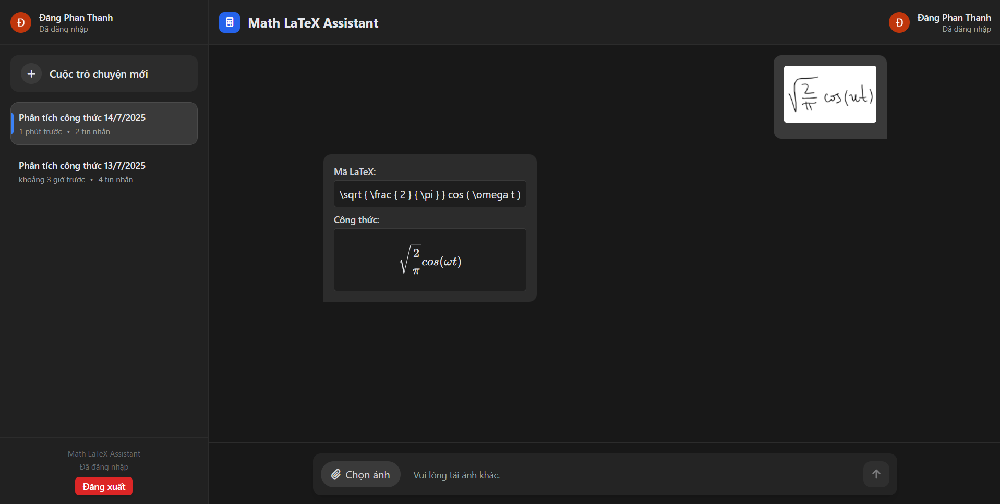
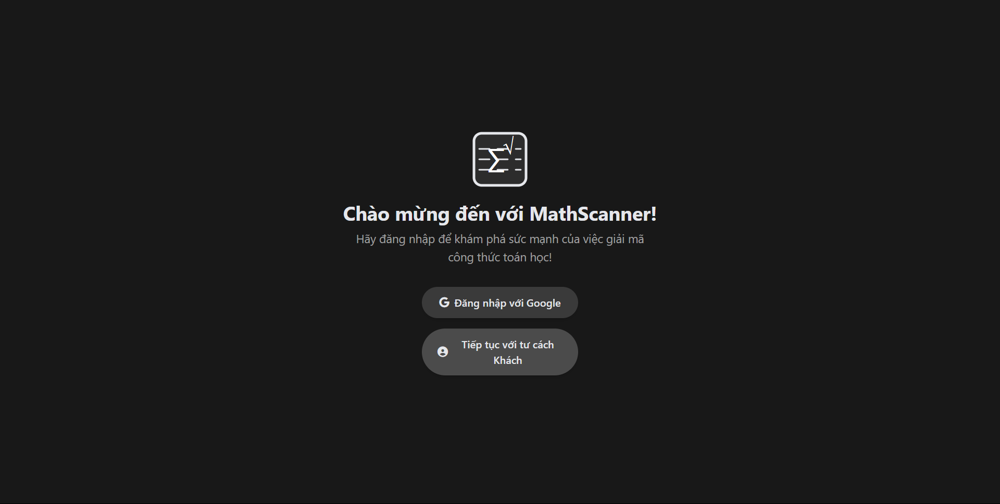
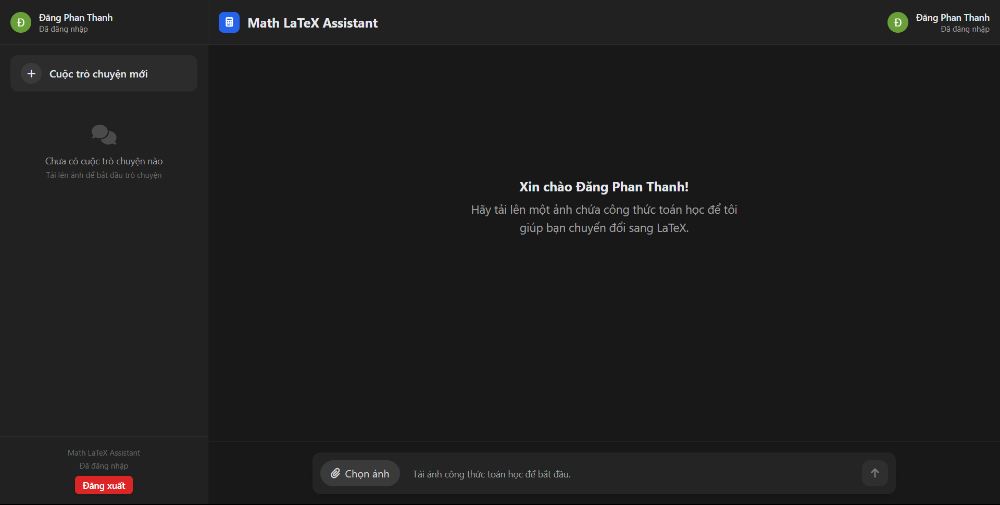

# 🤖 Math LaTeX Assistant — Handwritten Formula Chatbot

An AI-powered chatbot that translates handwritten mathematical formulas into LaTeX and lets users interact in a seamless, intuitive way. Built to demonstrate the synergy between Computer Vision, NLP, and modern web technologies.



---

## 🚀 Features

- 🧠 **Image-to-LaTeX Recognition**: Upload handwritten formula images and get high-accuracy LaTeX predictions.
- 💬 **Real-time Chat Interface**: Clean, responsive chat interface.
- 🔐 **Authentication**:
  - Google Sign-in (via Firebase)
  - Guest Mode with session timeout
- 💾 **Conversation Management**:
  - Rename, delete, and persist conversations (for authenticated users)
  - Auto-title generation from first message
- 📦 **Full-Stack Architecture**:
  - Frontend: React + Tailwind CSS
  - Backend: FastAPI with Firebase token verification
  - Model Integration: Calls a Python-based LaTeX prediction service

---

## 🛠️ Tech Stack

| Layer        | Technology                          |
|--------------|-------------------------------------|
| Frontend     | React, Tailwind CSS, Firebase Auth  |
| Backend      | FastAPI, Firebase Firestore (optional), Python |
| ML API       | Image-to-LaTeX Model (custom or hosted) |
| Deployment   | Vite, Docker-ready backend          |

---

## 📸 Chatbot

### 🔓 Login Options


### 💬 Chat Interface (Authenticated)


---

## ⚙️ How It Works

1. **User uploads a handwritten math image**
2. **The system creates or continues a conversation**
3. **The image is sent to the backend → forwarded to model API**
4. **Predicted LaTeX returned and displayed**
5. **Conversations are stored & retrievable (for logged-in users)**

---

## 📁 Project Structure
```
client/
├── src/
│ ├── components/ # Header, Sidebar, ChatArea, UploadBar, AuthScreen
│ ├── hooks/ # useChatManager, useFirebase
│ ├── App.jsx
│ └── App.css
│ └── index.css
│ └── main.jsx
├── Dockerfile

server/
├── app/
│ ├── main.py # FastAPI entrypoint
│ ├── auth.py # Firebase token verification
│ ├── chat.py # Conversations & Messages
│ └── models.py
│ └── services.py
│ └── config.py
├── requirements.txt
├── Dockerfile
```


---

## ✅ Highlights

- 🔒 Firebase Authentication + Custom Backend Auth Middleware
- 🖼️ Dynamic image preview and upload with base64 conversion
- ✨ Seamless scroll and UI transitions (no double scrollbars)
- 📌 Smart session timeout handling for guest users
- 🎯 Designed with clean UX for real-world usability

---

## 🧠 Potential Improvements

- Integrate OCR confidence score & correction suggestions
- Markdown export or PDF rendering of LaTeX output
- WebSocket support for real-time multi-user chat

---

## ⭐️ If you like this project

Feel free to fork, star 🌟, and connect — I'm currently looking for software engineering or research internship opportunities!